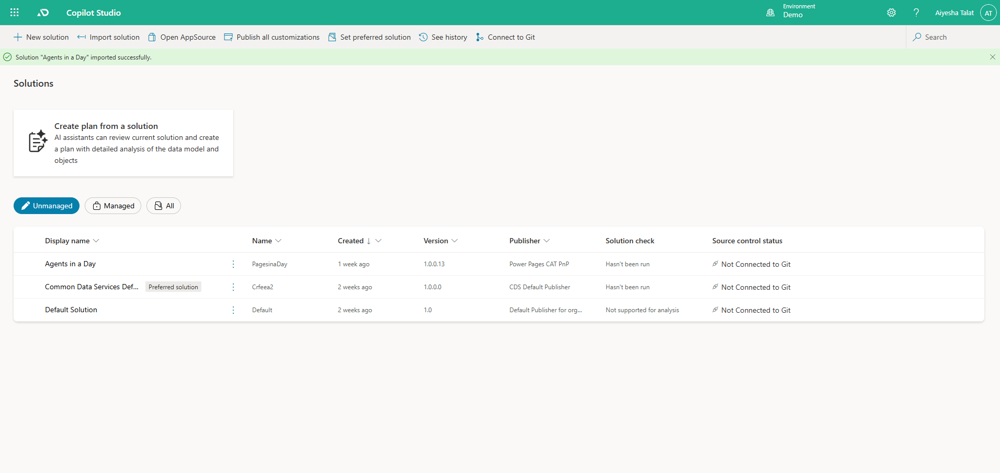
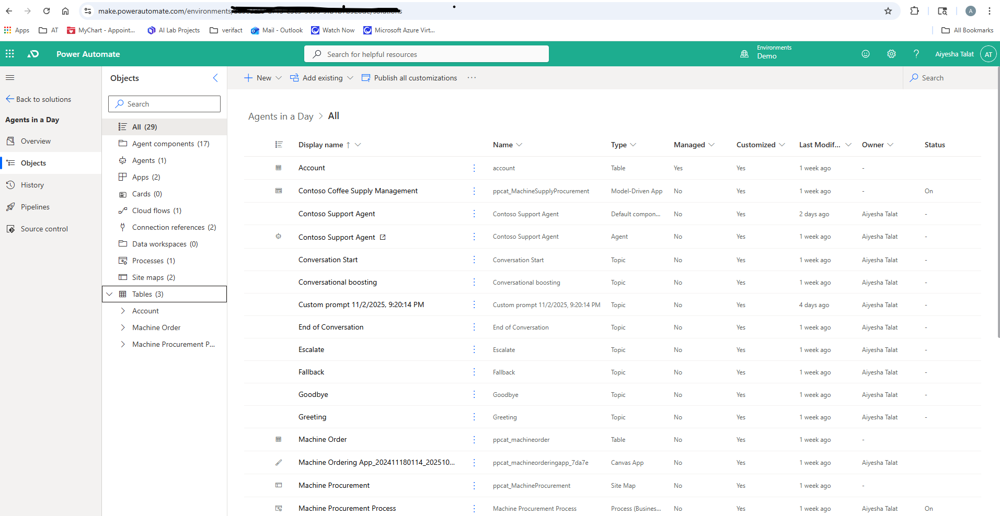

# Day 1 — Setup & Environment Verification

## Goal
Get Copilot Studio and Demo environment ready.

## Tasks completed
- Opened Module 1: Introduction to Agents
- Verified Demo (Developer) environment in Power Platform Admin Center
- Confirmed access to Copilot Studio
- Downloaded/unzipped Agent IAD package

## Evidence
- Screenshot: Firstwork

## Notes / Issues
- No issues encountered during setup.
