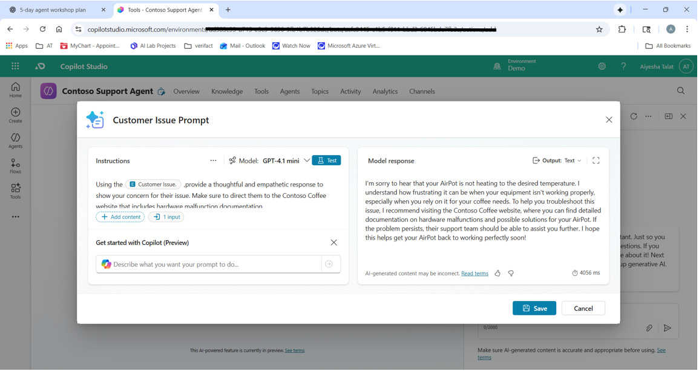
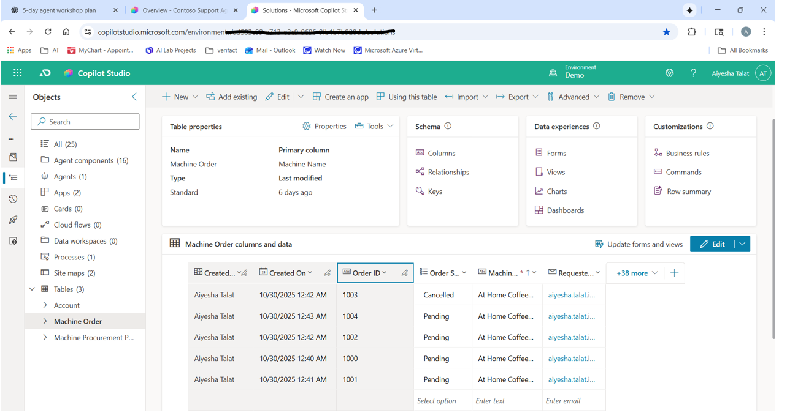

# Day 3 — Using Tools

## Goal
Extend agent with tools for advanced functionality.

## Tasks completed
- Completed Module 3: Use tools in Copilot Studio
- Built custom prompt and tested tool integration (e.g., order cancellation)

## Evidence
- Screenshot: Day3

## Notes / Learnings
- (Prompt phrasing changes, tool behaviour)
