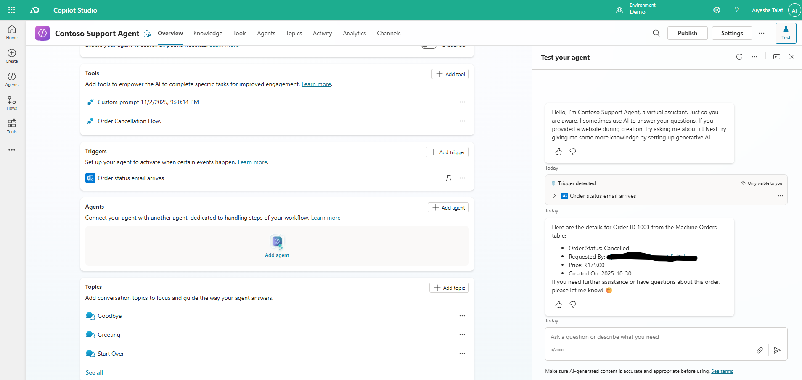
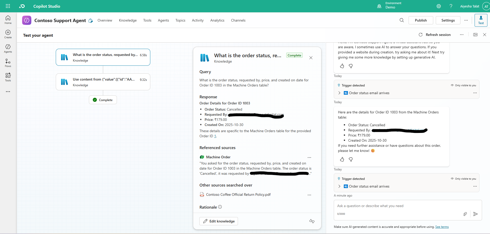

# Day 4 — Autonomy

## Goal
Make your agent autonomous.

## Tasks completed
- Completed Module 4: Make your agent autonomous in Copilot Studio
- Added autonomous triggers and customized conditions
- Tested and published agent

## Evidence
- Screenshot: Day4

## Notes / Issues
- (Any trigger or publish issues; if none, "No issues encountered")
