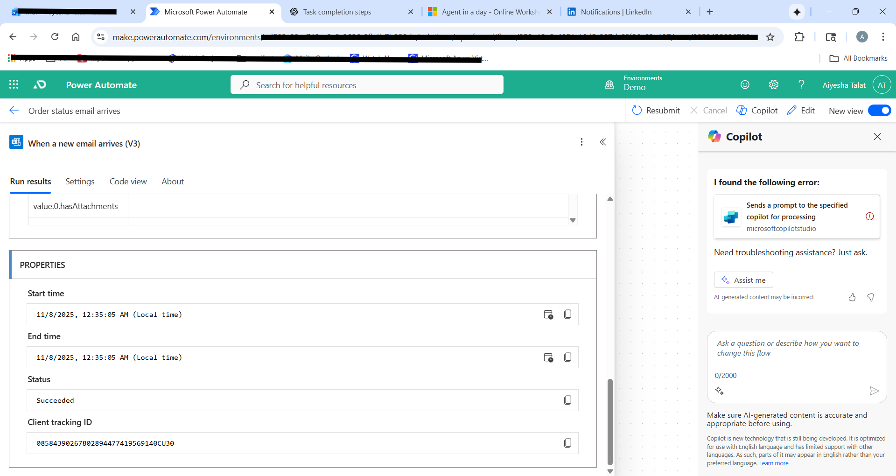
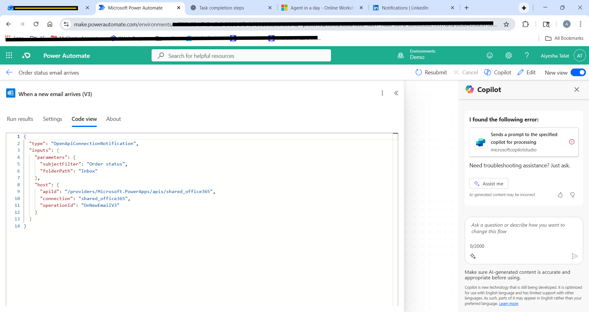

# Day 5 — Review & Finalization

## Goal
Consolidate learning and ensure all agents are functional.

## Tasks completed
- Revisited any incomplete exercises
- Tested agents end-to-end in Copilot Chat & Copilot Studio
- Documented key learnings and challenges

## Test summary
- Total test cases: X
- Passed: Y
- Failed: Z

## Evidence
- Screenshot: Day5

## Notes / Next steps
- (Write improvements or next actions)
